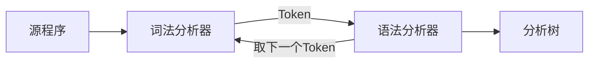

## 概述

程序设计语言构造的语法可使用 **上下文无关文法** 或 **BNF 表示法** 来描述

## 语法分析器的作用



- 功能：根据文法规则，从源程序单词符号串中识别出语法成分，并进行语法检查
- **基本任务**：识别符号串 $ S $ 是否为某个合法的语法单元

## 语法分析器的种类

分类

- 通用语法分析器
    - 可以对任意文法进行语法分析
    - 效率很低，不适合用于编译器
- **自顶向下** 的语法分析器
    - 从语法分析树的根部开始构造语法分析树
- **自底向上** 的语法分析器
    - 从语法分析树的叶子开始构造语法分析树

后两种方法

- 通常从左到右逐个扫描词法单元
- 为了保证效率，**只针对特定类型的文法**，但是这些文法足以用来描述常见的程序设计语言

## 文法（Grammar）

**定义**：文法 $ G = (V_T, V_N, S, P) $，其中：

- $ V_T $ 是一个非空有穷的 **终结符号（terminal）** 集合
- $ V_N $ 是一个非空有穷的 **非终结符号（nonterminal）** 集合，且 $ V_T \cap V_N = \varnothing $
- $ P = \{ \alpha \to \beta | \alpha \in (V*T \cup V_N)^*\text{且至少包含一个非终结符号}, \beta \in (V*T \cup V_N)^*\} $，称为 **产生式（production）** 集合
    - BNF 范式：产生式可以写成 $ A ::= \alpha $ 或 $ A \rightarrow \alpha $
    - $ A \rightarrow \alpha_1 \quad A \rightarrow \alpha_2 $ 可以缩写为：$ A \rightarrow \alpha_1 | \alpha_2 $
- $ S \in V_N $，称为 **开始符号（start symbol）**$ S $ 必须在某个产生式的左部至少出现一次

### 关于文法的一些约定

通常可以不用将文法 $ G $ 的四元组显式地表示出来，而只需将产生式写出，一般约定：

- **第一条产生式 **$ P_0 $ 的左部是 **开始符号**
- 用 **尖括号 **$ <> $ 括起来的是 **非终结符号**，而 **不用尖括号** 的是 **终结符号**
- 或者 **大写字母 **$ ABC $ 表示 **非终结符号**，**小写字母 **$ abc $ 表示 **终结符号**
- **小写的希腊字母 **$ \alpha \beta \gamma $ 表示 **（可能为空的）** 文法符号串

另外也可以把 $ G $ 表示为 $ G[S] $，其中 $ S $ 为开始符号

### 上下文无关文法（Context-free grammar，CFG）

**所有产生式的左边只有一个非终结符号**，即

- 产生式的形式为：$ A \rightarrow \beta $
- 因此不需要任何上下文（context）就可以对 $ A $ 进行推导

上下文无关文法描述的语言称为上下文无关语言

## 推导 / 规约

### 直接推导 / 直接规约

**直接推导（Immediate Derivation）/ 直接规约（Immediate Reduction）**：若某个串 $ \alpha $ 可以根据某条文法一步化为串 $ \beta $，则称：

- $ \alpha $ 可以直接推导出 $ \beta $
- $ \beta $ 可以直接归约到 $ \alpha $

标准定义：令语法 $ G=(V_T, V_N, S, P) $，若 $ \alpha \to \beta \in P $，且 $ \gamma, \delta \in (V_T \cup V_N)^\* $，则称 $ \gamma \alpha \delta $ 可以直接推导出 $ \gamma \beta \delta $，表示为：

$ \gamma \alpha \delta \Rightarrow \gamma \beta \delta $

如果 $ \gamma \alpha \delta $ **直接推导（左到右）** 出 $ \gamma \beta \delta $，即 $ \gamma \alpha \delta \Rightarrow \gamma \beta \delta $，则称 $ \gamma \beta \delta $ **直接归约（右到左）** 到 $ \gamma \alpha \delta $。

规约是推导的逆过程。

### 推导（Derivation）

若一个直接推导序列为：

$ \alpha_0 \Rightarrow \alpha_1 \Rightarrow \alpha_2 \Rightarrow \ldots \Rightarrow \alpha_n \quad (n > 0) $

可以表示为：

$ \alpha_0 \Rightarrow^+ \alpha_n $

拓展定义 $ \alpha_0 \Rightarrow^\* \alpha_n $ 为：

- 要么 $ \alpha_0 = \alpha_n $ （直接就是）
- 要么 $ \alpha_0 \Rightarrow^+ \alpha_n $ （经过几次推导）

> 这里类似正则表达式，在正则表达式中：
>
> - `+` 代表一次或者多次匹配
> - `*` 代表零次或者多次匹配

### 最左推导和最右推导

对于文法 $ G $ 和字符串 $ w $，如果 $ w \in L(G) $，即 $ w $ 可以由 $ G $ 生成，那么有如下构造推导 $ S \Rightarrow^\* w $ 的方法：

- **最左推导**：若 $ \alpha A \beta \Rightarrow\_{lm} \alpha \gamma \beta $， $ \alpha \in V_T^\* $，即 $ \alpha $** 是一个由终结符组成的字符串**。
- **最右推导**：若 $ \alpha A \beta \Rightarrow\_{rm} \alpha \gamma \beta $， $ \beta \in V_T^\* $，即 $ \beta $** 是一个由终结符组成的字符串**。

**最左推导每次替换最左边的非终结符，而最右推导每次替换最右边的非终结符。**

## 句型 / 句子 / 语言

### 句型（sentential form）

如果 $ S \Rightarrow^\* \alpha $，那么 $ \alpha $ 是文法的句型

- 句型 **可能既包含非终结符号，又包含终结符号**
- 句型也 **可以是空串**

> 型 → 行，即可以达到的状态

### 句子（sentence）

文法的句子是 **不包含非终结符号** 的句型（即全是终结符号，最终状态）

> 子 → 子集（即最具体的句子）

### 语言

文法 $ G $ 的语言是 $ G $ 的所有 **句子** 的集合，记为 $ L(G) $

$ w $ 在 $ L(G) $ 中当且仅当 $ w $ 是 $ G $ 的句子，即 $ S \Rightarrow^\* w $

### 证明文法生成的语言

基本步骤：

1. 首先证明 $ L(G) \subseteq L $（文法 $ G $ 生成的任意句子都属于语言 $ L $）
2. 然后证明 $ L \subseteq L(G) $（语言 $ L $ 的任意句子都可以用文法 $ G $ 生成）
3. 一般可以使用 **数学归纳法**。
    - $ L(G)\subseteq L $：按推导序列的长度来归纳
    - $ L\subseteq L(G) $：按符号串长度来构造推导序列

#### 文法生成语言的例子

文法 $ G $：$$ S \rightarrow (S)S \mid \varepsilon $$

语言 $ L $：所有具有对称括号的串。

$ L(G) \subseteq L $ 的证明：依据 **推导序列的长度** 来归纳

- **归纳基础**：推导长度为 $ n=1 $, $ S \Rightarrow \varepsilon $，满足括号对称。
- **归纳步骤**：假设长度小于 $ n $ 的推导都能得到括号对称的句子。考虑推导步骤为 $ n $ 的最左推导：

$ S \Rightarrow*{lm} (S)S \Rightarrow*{lm}^{_} (x)S \Rightarrow\_{lm}^{_} (x)y $

- 其中 $ x $ 和 $ y $ 的 **推导步骤** 都小于 $ n $，因此 $ x $ 和 $ y $ 也是括号对称的句子即依据 **推导路径长度** 来进行归纳

$ L \subseteq L(G) $ 的证明：依据 **生成句子长度** 来进行归纳

- 注意：指括号对称的串的长度必然是偶数。
- **归纳基础**：如果指括号对称的串的长度为 $ 0 $，那么它可以从 $ S $ 推导得到。
- **归纳步骤**：假设长度小于 $ 2n $ 的指括号对称的串都能被 $ S $ 推导得到，$ w $ 是括号对称且长度为 $ 2n $ 的串。那么，$ w $ 必然以左括号开头，且可以写成 $ (x)y $ 的形式，其中 $ x $ 也是括号对称的。因为 $ x $、$ y $ 的长度都小于 $ 2n $ ，根据归纳假设，$ x $ 和 $ y $ 都可以从 $ S $ 推导得到，进而 $ w $ 可以从 $ S $ 推导得到：

$ S \Rightarrow*{lm} (S)S \Rightarrow*{lm}^{_} (x)S \Rightarrow\_{lm}^{_} (x)y $

## 语法解析树（Parse Tree）

**语法解析树**：推导的一种图形表示形式

- **根节点**：文法的开始符号 $ S $
- **叶子节点**：非终结符号、终结符号或 $ \varepsilon $
- **内部节点（即非叶子节点）**：非终结符号
    - 每个内部节点往下推，表示某个产生式的一次应用
    - 内部节点的标签为产生式左部，该节点的子节点从左到右对应产生式的右部

<!-- 这是一张图片，ocr 内容为： -->


画的时候可以从顶向下推导，也可以从底向上规约。

几点说明：

- 有时允许根不是开始符号（对应于某个短语）
- 树的叶子组成的序列是根的文法符号的句型
- 一棵解析树可对应多个推导序列，但是解析树和最左（右）推导序列之间具有一一对应关系

## 二义性 / 歧义性（Ambiguity）

### 定义

- 如果一个文法中存在某个句子有两棵解析树，那么该句子是 **二义性的**
- 如果一个文法产生二义性的句子，则称这个文法是 **二义性的**
- 否则，该文法是 **无二义性的**

#### 举例

考虑下面的表达式文法 $ G2[E] $，其产生式如下：

$ E \rightarrow E + E \mid E \* E \mid (E) \mid a $

对于句子 $ a + a \* a $，有如下两个最左推导：

$ E \Rightarrow E + E \Rightarrow a + E \Rightarrow a + E _ E \Rightarrow a + a _ E \Rightarrow a + a \* a $

$ E \Rightarrow E _ E \Rightarrow E + E _ E \Rightarrow a + E _ E \Rightarrow a + a _ E \Rightarrow a + a \* a $

<!-- 这是一张图片，ocr 内容为： -->


#### 几点说明

1. 一般来说，程序语言存在 **无二义性文法**。
2. 在能够驾驭的情况下，经常使用二义性文法 条件语句通常使用二义性文法描述。
3. 对于任意一个上下文无关文法，不存在一个算子，判定它是无二义性的； 但能够给出一组充分条件，满足这组充分条件的文法是无二义性的。
4. 存在 **先天二义性** 的 **语言**，即语言本身就是二义性，无论采用何种文法描述。 例如：$ \{ a^i b^i c^j | i, j \geq 1 \} \cup \{ a^i b^j c^j | i, j \geq 1 \} $ 存在一个二义性的句子 $ a^k b^k c^k $。

## 上下文无关文法和正则表达式

上下文无关文法比正则表达式的能力 **更强**：

- 所有的正则语言都可以使用上下文无关文法描述。
- 但是一些用上下文无关文法描述的语言不能用正则文法描述。

### 用上下文无关文法描述的语言不都能用正则文法描述

1. 首先证明：存在上下文无关文法 $ S \rightarrow aSb \mid ab $ 描述了语言 $ \{ a^n b^n | n > 0 \} $，但是它 **无法用 DFA 识别**。
2. 反证法：假设 DFA 识别该语言，设这个文法有 $ k $ 个状态。 那么在其尝试识别 $ a^{k+1} $ （即输入串中有 $ k+1 $ 个 $ a $）的输入串时，必然两次到达同一个状态（$ a $ 到 $ a^k $ 最多用 $ k $ 个状态，再来一个肯定重复，也即抽屉原理）。 设自动机在第 $ i $ 和第 $ j $ 个输入 $ a $ 时到达同一个状态（那么就形成了环路）。 那么，因为 DFA 识别 $ L $，$ a^i b^i $ 必然到达接受状态。 由于 $ a^i $、$ a^j $ 使得 DFA 到达同一个状态，所以 $ a^j b^i $ 也必然到达接受状态。 这与 $ a^j b^i $ 不是语言的句子矛盾。

### 任何正则语言都可以表示为上下文无关文法的语言

首先，任何正则语言都必然有一个等价的 NFA。

而对于任意的 NFA 可以构造如下的上下文无关文法：

1. 对 NFA 的每个状态 $ i $，创建非终结符号 $ A_i $
2. 如果有 $ i $ 在输入 $ a $ 上到达 $ j $ 的转换，增加产生式 $ A_i \rightarrow a A_j $
3. 如果 $ i $ 在输入 $ \varepsilon $ 上到达 $ j $，那么增加产生式 $ A_i \rightarrow A_j $
4. 如果 $ i $ 是一个接受状态，增加产生式 $ A_i \rightarrow \varepsilon $
5. 如果 $ i $ 是初始状态，令 $ A_i $ 为所得文法的开始符号

## 非上下文无关的语言结构

在程序语言中，某些语言结构 **不能总能用上下文无关文法** 描述。

1. **例 1**

$ L_1 = \{ wcw \mid w \in \{a,b\}^+ \} $

    - 例如，`aabcaab` 是 $ L_1 $ 的一个句子
    - 该语言是检查程序中标识符的声明应先于引用的抽象（先声明 $ w $，隔了 $ c $，再引用 $ w $）

```cpp
int a;
// ...
a++;
```

2. **例 2**

$ L_2 = \{ a^n b^m c^n d^m \mid n,m \geq 0 \} $

    - 它是检查程序声明的形参个数和过程调用的实参个数一致的问题的抽象（先 $ n $ 个 $ a $，再 $ m $ 个 $ b $，再 $ n $ 个 $ c $，再 $ m $ 个 $ d $）

```cpp
int f(int a, int b){
  //...
}
f(1, 2)
```

## 文法分类（Chomsky）

### 0 型（任意文法）

$ G = (V_T, V_N, S, P) $

- 规则形式：$ \alpha \rightarrow \beta, {~}{~}\alpha, \beta \in (V_T \cup V_N)^\*, {~}{~}\alpha \neq \varepsilon $
- 翻译：任意非空串到任意串
- 推导：$ \gamma \alpha \delta \Rightarrow \gamma \beta \delta $

### 1 型（上下文有关，Context-Sensitive Grammar）

- 规则形式：$ \alpha A \beta \rightarrow \alpha \gamma \beta,{~}{~}A \in V_N, {~}{~}\alpha, \gamma, \beta \in (V_T \cup V_N)^\*,{~}{~} \gamma \neq \varepsilon $
- 翻译：需要一个上下文（式中 $ \alpha,\beta $），然后发生一次非终止符号到任意串的推导
- 注：可以包含 $ S \to \varepsilon $，但此时不允许 $ S $ 出现在产生式右边

### 2 型（上下文无关，Context-Free Grammar, CFG）

- 规则形式：$ A \rightarrow \beta, {~}{~}A \in V_N, {~}{~}\beta \in (V_T \cup V_N)^\* $
- 翻译：没有上下文，产生式左侧只能为一个非终止符号，右侧可以为任意串
- 上下文无关语法是没有记忆的

### 3 型（正则文法，Regular Grammar）

- 右线性：$ A \rightarrow aB, {~}{~}A \rightarrow a $
- 左线性：$ A \rightarrow Ba, {~}{~}A \rightarrow a, {~}{~}a \in V_T \cup \{ \varepsilon \} $
- 两种只能选其一
- 翻译：产生式左侧只能为一个非终止符号，右侧最多包含两个符号，且其中一个必须是非终结符

### 总结

- **每一类逐渐对产生式施加限制，表示范围逐步缩小。**
- 任意文法 > 上下文有关**（可以有记忆）**> 上下文无关**（没有记忆）**> 正则文法

### 在程序语言中的实际应用

- 与词法相关的规则属于 **正则文法**
- 与局部语法相关的规则属于 **上下文无关文法**
- 与全局语法和语义有关的部分主要用 **上下文有关文法** 来描述，实际上很少使用
- 为简化分析过程，会把 **描述词法的正则文法** 从 **描述语法的上下文无关文法** 中分离出来在分离出正则文法后的上下文无关文法中，这些单词符号属于终结符号 $ V_T $ 中的符号

## 文法的设计方法

### 消除二义性

一些二义性文法可以被改成等价的无二义性文法

### 例子：dangling-else

$ \begin{aligned}
\text{stmt} \rightarrow& \textbf{if} \ \text{expr} \ \textbf{then} \ \text{stmt} \\
|& \textbf{if} \ \text{expr} \ \textbf{then} \ \text{stmt} \ \textbf{else} \ \text{stmt} \\
|& \text{other}
\end{aligned} $

在这个语法下，$ \textbf{if} \ \text{expr}\_1 \ \textbf{then} \ \textbf{if} \ \text{expr}\_2 \ \textbf{then} \ \text{stmt}\_1 \ \textbf{else} \ \text{stmt}\_2 $ 有两棵语法树：

<!-- 这是一张图片，ocr 内容为： -->


即：这个 else 既可以和第一个 then 匹配，也可以和第二个 then 匹配。

#### 消除 dangling-else 二义性

引入 `matched_stmt` 表示匹配好的语句，文法如下：

$ \begin{aligned}
\text{stmt} \rightarrow& \text{matched_stmt} | \text{open_stmt} \\
\text{matched_stmt} \rightarrow& \textbf{if} \ \text{expr} \ \textbf{then} \ \text{matched_stmt} \ \textbf{else} \ \text{matched_stmt} \\
|& \text{other} \\
\text{open_stmt} \rightarrow& \textbf{if} \ \text{expr} \ \textbf{then} \ \text{stmt} \\
|& \textbf{if} \ \text{expr} \ \textbf{then} \ \text{matched_stmt} \ \textbf{else} \ \text{open_stmt}
\end{aligned} $

即：通过引入新的非终结符，来保证 else 与最近未匹配的 then 匹配。

### 例子：近对称符号串

文法 $ G $ 的产生式如下：

$ S \rightarrow aSb \,|\, bSa \,|\, SS \,|\, ba \,|\, ab $

$ L(G) $：

- 最小单元：$ abab,aabb,baba,bbaa $
- 最小单元外侧可以对称着包 $ a\cdots b $ 或者 $ b\cdots a $
- 然后包完了还可以重复

#### 二义性示例

$ G $ 是二义性的，例如 $ ababab $ 有两个不同的最左推导：

1. $ S \Rightarrow SS \Rightarrow abS \Rightarrow abSS \Rightarrow ababab $
2. $ S \Rightarrow SS \Rightarrow SSS \Rightarrow abS \Rightarrow ababab $

#### 等价上下文无关文法

$ \begin{aligned}
S &\rightarrow TS \,|\, T \\
T &\rightarrow aB \,|\, bA \\
A &\rightarrow a \,|\, bAA \\
B &\rightarrow b \,|\, aBB
\end{aligned} $

### 消除文法中的左递归

**文法左递归**：$ A\Rightarrow^+A\alpha $

- **直接左递归**：直接左递归经过一次推导就可以看出文法存在左递归

$ A \rightarrow A \alpha \mid \beta $

- **间接左递归**：间接左递归是指需多次推导才可以看出文法存在左递归

$ S \rightarrow A a \mid b \\
A \rightarrow S d \mid \varepsilon $

#### 消除直接左递归

将原始规则 $ A \rightarrow A \alpha \mid \beta $ 转换为：

$ \begin{aligned}
A &\rightarrow \beta A' \\
A' &\rightarrow \alpha A' \mid \varepsilon
\end{aligned} $

#### 消除间接左递归

1. 先转换成直接左递归： 使用替换法，将 $ S $ 的规则替换为 $ A $ 的规则：

$ \begin{aligned}
S &\rightarrow A a \mid b \\
A &\rightarrow S d \mid \varepsilon
\end{aligned} $

2.  转换为：

$ \begin{aligned}
S &\rightarrow A a \mid b \\
A &\rightarrow A a d \mid b d \mid \varepsilon
\end{aligned} $

3. 再消除左递归：

$ \begin{aligned}
A &\rightarrow b d A' \mid A' \\
A' &\rightarrow a d A' \mid \varepsilon
\end{aligned} $

### 消除所有左递归的算法

1. 将文法 $ G $ 的非终结符顺序整理为 $ A_1, A_2, \cdots, A_n $。
2. 逐步消除间接左递归

**理解**：循环操作，先避免 $ A_i \rightarrow A_j r\ (j < i) $ 的退化，再消除 $ A_i $ 的左递归，从而避免了所有非终结符的左递归

    1. 对于每个 $ i $ 从 1 到 $ n $，对于每个 $ j $ 从 1 到 $ i-1 $，将形如 $ A_i \rightarrow A_j r $ 的规则替换为：

$ A_i \rightarrow \delta_1 r \mid \delta_2 r \mid \cdots \mid \delta_k r $

    2.  其中，$ A_j \rightarrow \delta_1 \mid \delta_2 \mid \cdots \mid \delta_k $ 是当前 $ A_j $ 的所有产生式。
    3. 然后，消除 $ A_i $ 规则中的直接左递归。

3. 化简得到的文法

## 预测分析法

**预测分析法**：试图从开始符号推导出输入符号串

- 以开始符号 $ S $ 作为初始的当前句型
- 每次为最左边的非终结符号选择适当的产生式
    - 通过查看下一个输入符号来选择这个产生式
    - 有多个可能的产生式时预测分析法无能为力

问题：**当两个产生式具有相同的前缀时无法预测**

文法：

$ \begin{aligned}
\text{stmt} \rightarrow& \textbf{if} \ \text{expr} \ \textbf{then} \ \text{stmt} \ \textbf{else} \ \text{stmt} \\
|& \textbf{if} \ \text{expr} \ \textbf{then} \ \text{stmt}
\end{aligned} $

处理办法：**提取左公因子**

新文法：

$ \begin{aligned}
\text{stmt} \rightarrow& \textbf{if} \ \text{expr} \ \textbf{then} \ \text{stmt} \ \text{elsePart} \\
\text{elsePart} \rightarrow& \textbf{else} \ \text{stmt} \mid \varepsilon
\end{aligned} $

### 提取左公因子

含有左公因子的文法：

$ A \rightarrow \alpha \beta_1 \mid \alpha \beta_2 $

提取左公因子：

$ \begin{aligned}
A &\rightarrow \alpha A' \\
A' &\rightarrow \beta_1 \mid \beta_2
\end{aligned} $

### 自顶向下的语法分析

**定义**：自顶向下分析是从文法的开始符号出发，试构造出一个 **最左推导**，从左至右匹配输入的单词串。

**步骤**：

1. **推导替换**：
    - 当前被替换的非终结符号为 $ A $
    - 当前从左至右读到的单词符号为 $ a $
2. **匹配产生式**：
    - 如果 $ A $ 的产生式为：$ A \rightarrow \alpha_1 \mid \alpha_2 \mid \cdots \mid \alpha_n $
    - 其中由 $ \alpha_i(1 ≤ i ≤ n) $ 推导出的第一个终结符号为 $ a $，则选择产生式 $ A \rightarrow \alpha_i $ 构造最左推导
3. **策略**：
    - 用 $ \alpha_i $ 替换 $ A $，进行预测分析
    - 如果匹配失败，则进行回溯尝试

### 关键点

- 自顶向下分析通过 **试探和回溯** 来构造符合输入的句子结构。
- 最左推导是核心策略，确保每一步都尽可能匹配输入的左边部分。

### 回溯的解决

对文法加什么样的限制可以保证没有回溯？

> 在自顶向下的分析技术中，通常使用向前看几个符号来唯一地确定产生式（这里只假定只看一个符号）。

1. 假设当前句型是 $ xA\beta $，而输入是 $ xa\cdots $，那么选择产生式 $ A \rightarrow \alpha $ 的 **必要条件** 是下列之一：
    - $ \alpha \Rightarrow^\* \varepsilon $ 且 $ \beta $ 以 $ a $ 开头（可以用更强的条件替代：在某个句型中 $ a $ 跟在 $ A $ 之后）
    - $ \alpha \Rightarrow^\* a\cdots $
2. 如果按照这两个条件选择时能够保证唯一性，那么我们就可以避免回溯

总结：

- 使用向前看符号（展望符号）来唯一确定产生式
- 确保选择产生式时满足特定条件以避免回溯

## First 和 Follow

### First 集合

**First**：可以从某个符号串 $ \alpha $ 推导出的串的首符号（终结符）的集合。

- 形式化定义：

$ \text{First}(\alpha) = \{a \mid \alpha \Rightarrow^\* a\cdots, a \in V_T\} $

- 其中，$ V_T $ 是终结符的集合
- 特别地，如果 $ \alpha \Rightarrow^\* \varepsilon $，即 $ \alpha $ 可以推导出空串 $ \varepsilon $，那么我们规定 $ \varepsilon \in \text{First}(\alpha) $

简单来说，**First 集合包含了 **$ \alpha $** 能够推导出的所有串的第一个终结符**。

### Follow 集合

**Follow**：可能在某些句型中紧跟在非终结符 $ A $ 右边的终结符的集合。

- 形式化定义：

$ \text{Follow}(A) = \{a \mid S \Rightarrow^\* \cdots Aa\cdots, a \in V_T\} $

- 其中，$ S $ 是开始符号
- 如果 $ A $ 是某个句型的最右符号时，那么 $$ \$ $$ 也属于 $\text{Follow}(A)$

简单来说，**Follow 集合包含了在某些推导过程中可能出现在 **$ A $** 右边的终结符**。

### 计算 First 集合

#### 计算单个符号 X 的 First 集合

**终结符**：如果 $ X $ 是终结符，那么 $ \text{First}(X) = \{X\} $。

**非终结符**：

1. 如果 $ X $ 是非终结符，并且 $ X \rightarrow Y_1Y_2\cdots Y_k $ 是一个产生式：
    - 如果某个 $ a $ 在 $ \text{First}(Y*i) $ 中，并且 $ \varepsilon $ 在 $ \text{First}(Y_1), \text{First}(Y_2), \cdots, \text{First}(Y*{i-1}) $ 中，那么 $ a $ 也在 $ \text{First}(X) $ 中 **人话**：如果 $ \varepsilon $ 在这些 $ \text{First}(Y_i) $ 中，那么就意味着 $ Y_i \Rightarrow^\* \varepsilon $，也就可以忽略前面的
    - 如果 $ \varepsilon $ 在 $ \text{First}(Y_1), \text{First}(Y_2), \cdots, \text{First}(Y_k) $ 中，那么 $ \varepsilon $ 也在 $ \text{First}(X) $ 中 **人话**：所有的子部分都可以推出空串，那么 $ X $ 也可以推出空串
2. 如果 $ X $ 是非终结符，并且 $ X \rightarrow \varepsilon $ 是一个产生式，那么 $ \varepsilon $ 在 $ \text{First}(X) $ 中

#### 计算产生式右部 $ X_1 X_2 \cdots X_n $ 的 First 集合

1. 向集合中加入 $ \text{First}(X_1) $ 中所有非 $ \varepsilon $ 的符号
2. 如果 $ \varepsilon $ 在 $ \text{First}(X_1) $ 中，再加入 $ \text{First}(X_2) $ 中的所有非 $ \varepsilon $ 的符号
3. 依次类推，直到所有 $ X_i $ 被处理完
4. 如果 $ \varepsilon $ 在所有的 $ \text{First}(X_i) $ 中，则将 $ \varepsilon $ 加入 $ \text{First}(X_1 X_2 \cdots X_n) $ 中

### 计算 Follow 集合

1. 将右端结束标记 $$ \$ $$ 放到 $\text{Follow}(S)$ 中。
2. 不间断迭代以下规则，直到所有的 Follow 集合都不再增长为止：
    - 如果存在产生式 $ A \rightarrow \alpha B \beta $，那么 $ \text{First}(\beta) $ 中所有非 $ \varepsilon $ 的符号都在 $ \text{Follow}(B) $ 中 **人话**：此时即存在式子可以推导出 $ Bx, x \in \text{First}(\beta) $
    - 如果存在产生式 $ A \rightarrow \alpha B $，或者 $ A \rightarrow \alpha B \beta $ 且 $ \text{First}(\beta) $ 包含 $ \varepsilon $，那么 $ \text{Follow}(A) $ 中的所有符号都加入到 $ \text{Follow}(B) $ 中  **人话**：此时即  $ \text{Follow}(A) \sub \text{Follow}(B) $，因为对于每个 $ A $ 出现的式子，我们都可以执行这个替换，从而使得原本接在 $ A $ 后面的字符接到 $ B $ 后面

## LL (1) 文法

**定义**：对于文法中任意两个不同的产生式 $ A \rightarrow \alpha | \beta $：

1. 不存在终结符号 $ a $ 使得 $ \alpha $ 和 $ \beta $ 都可以推导出以 $ a $ 开头的串
2. $ \alpha $ 和 $ \beta $ 最多只有一个可以推导出空串
3. 如果 $ \beta $ 可以推导出空串，那么 $ \alpha $ 不能推导出以 $ \text{Follow}(A) $ 中任何终结符号开头的串 **理解**：如果可以，那么产生了二义性：
    - 对于 $ A $ 推导为 $ \beta $，然后再推导得到空串 $ \varepsilon $，接着后接 $ \text{Follow}(A) $ 中的字符
    - 对于 $ A $ 推导为 $ \alpha $，然后再推导得到 $ \text{Follow}(A) $ 中的字符

注：这里不一定只有 $ \alpha $ 和 $ \beta $ 两个产生式，而是所有可能的产生式，这里只是简写了（有 “任意两个” 这一条件）。

**这里主要是为了自顶向下的语法分析的时候能确定找到唯一路径。**

### 等价条件

对于文法中任意两个不同的产生式 $ A \rightarrow \alpha | \beta $：

- $ \text{First}(\alpha) \cap \text{First}(\beta) = \varnothing $ （条件 1, 2）
- 如果 $ \varepsilon \in \text{First}(\beta) $，那么 $ \text{First}(\alpha) \cap \text{Follow}(A) = \varnothing $ （条件 3）

### LL (1) 文法的说明

输入串以 $$ \$ $$ 为结束标记，这相当于对文法作扩充，即增加产生式 $$ S' \rightarrow S\$ $$ ，所以 $\text{Follow}(S)$ 一定包含 $$ \$ $$。

### 预测分析表的构造方法

- 输入：文法 $ G $
- 输出：预测分析表 $ M $，用于指导预测分析器如何根据当前输入符号和栈顶符号做出解析决策其中每一项 $ M[A, a] $ 表明当前栈顶是 $ A $，输入符号是 $ a $ 时，应该使用哪个产生式
- 构造方法：
    - 对于文法 $ G $ 的每个产生式 $ A \rightarrow \alpha $：对于 $ \text{First}(\alpha) $ 中的每个终结符号 $ a $，将 $ A \rightarrow \alpha $ 加入到 $ M[A, a] $ 中；如果 $ \varepsilon \in \text{First}(\alpha) $，那么对于 $ \text{Follow}(A) $ 中的每个符号 $ b $，将 $ A \rightarrow \alpha $ 加入到 $ M[A, b] $ 中。
    - 最后在所有的空白条目中填入 $ \text{error} $

<!-- 这是一张图片，ocr 内容为： -->


### LL (1) 文法解析例子

假设有以下文法：

$ \begin{aligned}
E &\rightarrow T E' \\
E' &\rightarrow + T E' | \varepsilon \\
T &\rightarrow F T' \\
T' &\rightarrow \* F T' | \varepsilon \\
F &\rightarrow ( E ) | id
\end{aligned} $

假设输入字符串为 $ id + id \* id $。

那么，LL (1) 分析器的工作流程如下：

首先计算出 First 集合：

$ \begin{aligned}
\text{First}(E) &= \{(, id)\} \\
\text{First}(E') &= \{+, \varepsilon\} \\
\text{First}(T) &= \{(, id)\} \\
\text{First}(T') &= \{\*, \varepsilon\} \\
\text{First}(F) &= \{(, id)\}
\end{aligned} $

1. 初始状态：
    - 输入：$$ id + id \* id \$ $$ （ $$ \$ $$ 是输入结束符）
    - 符号栈：$$ E \$ $$（注意，**左边是栈顶** ）
2. 根据预测：
    - 当前栈顶 $ E $ 和输入符号 $ id $ 使我们选择产生式 $ E \rightarrow T E' $
    - 更新符号栈为 $$ T E' \$ $$
3. 继续向下：
    - 栈顶 $ T $ 和输入符号 $ id $ 选择 $ T \rightarrow F T' $
    - 更新符号栈为 $$ F T' E' \$ $$
4. 接着：
    - 栈顶 $ F $ 和输入符号 $ id $ 使用 $ F \rightarrow id $，匹配后弹出 $ id $
    - 更新符号栈为 $$ T' E' \$ $$
5. 重复此过程，运用 First 集合和下一个输入符号进行预测，以此类推

### 错误处理

目的：**继续完成整段程序的语法分析**

思路：将预测分析表中的空白位置以某种方式填充

两种方法：恐慌模式 / 短语层次的恢复

语法错误的类型

- 词法错误：标识符 / 关键字拼写错误等
- 语法错误：分号位置错误，$ \{ \} $ 不匹配
- 语义错误：运算符和变量类型不匹配
- 逻辑错误：编译器看不出来，例如 = 和 == 写错导致的错误（但可以过编译）

### 恐慌模式

思路：忽略输入中的部分符号，直到出现特定的 **“同步词法单元”**，我们认为 “同步词法单元（sync）” 和之前的内容都属于当前符号（出错的这个符号），然后跳过该段，继续分析

省流：**当分析器遇到错误时，它会忽略一些输入符号，直到遇到某个可以继续解析的符号。**

方法：将 $ \text{First}(A) $ 和 $ \text{Follow}(A) $ 加入 $ A $ 的 **同步集合** 中。在预测分析表中，标记为 **sync**

假设出错时，我们在试图识别一个非终结符号 $ A $ （栈顶为 $ A $），遇到了终结符号 $ a $

- 如果 $ M[A, a] $ 为空，什么也不做，直接忽略 $ a $ （将之视为多打了的字符）
- 如果 $ M[A, a] $ 为 sync，则跳过 $ a $，弹出栈顶的 $ A $ （认为从当前位置一直到 $ a $ 都属于 $ A $ 的范畴），然后尝试继续正常的语法分析过程

### 短语层次的恢复

- 在 **预测分析表** 的空白位置，填入 **指向错误处理例程的指针**
- 错误处理例程的可能行为：
    - 改变 / 插入 / 删除符号
    - 发送错误信息
    - 弹栈
- 要避免死循环

## 自底向上语法分析

自底向上语法分析：将一个串 $ w $ **归约** 回到文法开始符号 $ S $ 的过程。

在每个归约（reduction）步骤中，一个与某 **产生式右部相匹配的特定子串** 被替换为该 **产生式左部** 的非终结符号。

下文中，对如下概念不加区分：

- 产生式左部 / 产生式头
- 产生式右部 / 产生式体

**归约**：是一个推导步骤的反向操作

- 推导步骤：将句型中的一个非终结符号替换为该符号的某个产生式的体 $ A \rightarrow \alpha $
- 归约步骤：与某产生式体匹配的子串被替换为该产生式头部的非终结符号 $ \alpha \leftarrow A $

### 自底向上语法分析的目标

目标：反向构造一个推导过程。

方法：对输入进行从左到右的扫描，并在扫描过程中进行自底向上语法分析，就可以反向构造出一个最右推导。

### 句柄（Handle）

**句柄**：是与某个 **产生式体** 匹配的 **子串**，对它的归约代表了相应的最右推导中的一个反向步骤（看接下来的形式定义会好理解一些）。

> Ref：
>
> - **前缀（prefix）**：移走 $ x $ 尾部的 **零个** 或多个连续的符号。
> - **后缀（suffix）**：移走 $ x $ 头部的 **零个** 或多个连续的符号。
> - **子串（substring）**：从 $ x $ 中删去一个前缀和一个后缀。

注意，和某个产生式体匹配的最左子串不一定是句柄（ **需要归约后能回到开始符号** ）。

#### 形式定义

若有 $ S {\Rightarrow}^{\*}_{\text{rm}} \alpha A w \Rightarrow_{\text{rm}} \underbrace{\alpha \beta w}\_{\gamma} $ ，那么紧跟在 $ \alpha $ 之后的 $ \beta $ 是 **句柄**。

最右句型：所有在最右推导中出现的句型，其内句柄右边的串 $ w $ 只包含终结符号。

将 $ \beta $ 替换为 $ A $ （ **规约** ）之后得到的串（$ \alpha A w $）是 $ \gamma $ 的某个 **最右推导序列** 中出现在位于 $ \gamma $（$ \alpha \beta w $） 之前的最右句型。

句柄可能存在多个，如果一个文法是 **无二义性** 的，那么该文法的 **每个最右句型都有且只有一个句柄**。

#### 句柄的寻找方法

给定：

$ S = \gamma*0 \stackrel{rm}{\Rightarrow} \gamma_1 \stackrel{rm}{\Rightarrow} \gamma_2 \stackrel{rm}{\Rightarrow} \cdots \stackrel{rm}{\Rightarrow} \gamma*{n-1} \stackrel{rm}{\Rightarrow} \gamma_n = w $

为了以相反顺序重构这个推导，我们在 $ \gamma*n $ 中寻找句柄 $ \beta_n $，并将 $ \beta_n $ 替换为相关产生式 $ A \rightarrow \beta_n $ 的头部 $ A $，得到前一个最右句型 $ \gamma*{n-1} $。

## 移入 - 归约语法分析技术

移入 - 归约语法分析是一种 **自底向上** 的语法分析技术，主要操作包括 **移入** 和 **归约**。

### 组成

- **栈**：存放已识别的文法符号，**句柄通常出现在栈的顶部**
- **输入缓冲区**：存放待分析的符号，通常显示在右侧

<!-- 这是一张图片，ocr 内容为： -->


### 主要操作

1. **移入（shift）**：将下一个输入符号移到栈的顶部
2. **归约（reduce）**：将栈顶符号串（右部）替换为相应的产生式左部
3. **接受（accept）**：语法分析成功完成
4. **报错（error）**：发现语法错误，并调用错误恢复工具

LR ($ k $) 中的 $ k $ 表示 **在输入中向前看 **$ k $** 个符号**。

移入 - 归约的语法分析技术可以使用栈中离栈顶很远的信息（向前看符号）来引导语法分析过程。

### 移入 - 归约语法分析中的冲突

有些上下文无关文法不能使用移入 - 归约语法分析技术。

即使知道了栈中的所有内容以及接下来的 $ k $ 个输入符号，我们仍然可能会遇到：

1. **移入 / 归约冲突**：无法判断应该进行移入还是归约操作
2. **归约 / 归约冲突**：无法在多个可能的归约方法中选择正确的归约动作

接下来，我们举例说明。

#### 移入 / 规约冲突举例

**定义**：在某个状态下，分析器既可以进行移入操作，也可以进行归约操作，但无法确定应该选择哪一种。

考虑以下文法：

1. $ E \rightarrow E + E $
2. $ E \rightarrow id $

假设当前状态是：

- 栈：$ id $
- 剩余输入：$ + id $

在这种情况下，分析器可以选择：

1. **移入**：将 $ + $ 移入栈中
2. **归约**：根据 $ E \rightarrow id $，将 $ id $ 归约为 $ E $

这是一个典型的移入 / 归约冲突，因为分析器无法确定是应该移入 $ + $ 还是进行归约。

#### 规约 / 规约冲突举例

**定义**：在某个状态下，分析器可以进行多种归约操作，但无法确定应当选择哪一种。

考虑以下文法：

1. $ S \rightarrow A $
2. $ S \rightarrow B $
3. $ A \rightarrow a $
4. $ B \rightarrow a $

假设当前状态是：

- 栈：$ a $
- 剩余输入：空

在这种情况下，分析器可以选择：

1. 根据 $ A \rightarrow a $ 进行归约。
2. 根据 $ B \rightarrow a $ 进行归约。

这是一个归约 / 归约冲突，因为分析器无法确定是应该将 $ a $ 归约为 $ A $ 还是 $ B $。

## LR ($ k $) 语法分析

**LR (**$ k $**)** 语法分析的定义：

- **L** 表示对输入进行从左到右的扫描
- **R** 表示反向构造出一个最右推导序列
- $ k $ 表示在做出语法分析决策时向前看 $ k $ 个输入符号（用于指导规约操作）

对于实际应用，$ k = 0 $ 和 $ k = 1 $ 具有重要意义，因此这里只考虑 $ k \leq 1 $ 的情况。当省略 $ k $ 时，假设 $ k = 1 $。

### LR (0) 项和 LR (0) 自动机

#### LR (0) 项

**项**：一些状态，这些状态表示了语法分析过程中所处的位置。

一个文法 $ G $ 的一个 **LR (0) 项** 是 $ G $ 的一个产生式再加上一个位于它的右侧某处的点。

举例：$ A \rightarrow XYZ $：

- $ A \rightarrow \cdot XYZ $
- $ A \rightarrow X \cdot YZ $
- $ A \rightarrow XY \cdot Z $
- $ A \rightarrow XYZ \cdot $

这里，$ \cdot $** 标记了当前读到的位置，**$ \cdot $** 左边是已经读到的，**$ \cdot $** 右边是尚未读到的。**

项表明了语法分析过程的给定点，我们已经看到一个产生式的哪些部分。

比如，$ A \rightarrow X \cdot YZ $ 表明当前已经读到了 $ X $，期望接下来在输入中看到一个从 $ YZ $ 推导得到的串（从而可以规约回 $ YZ $，再读入 $ YZ $ 后即可规约回 $ A $）。

LR (0) 项可分为四类：

1. **移进项**：$ A \to \alpha \cdot a \beta, \quad a \in V_T $，表示当前可以读取符号 $ a $ 并进行移入操作
2. **待归约项**：$ A \to \alpha \cdot B \beta, \quad B \in V_N $，表示当前需要继续其他操作后（至少还要把 $ B $ 给规约出来），才可以归约到 $ A $
3. **归约项**：$ A \to \alpha \cdot $，表示当前可以进行规约操作（已经把一个产生式体完全读入了），即将 $ \alpha $ 规约为 $ A $
4. **接受项**：$ S' \to S \cdot $

对于产生式 $ A \to \varepsilon $ 的唯一一项是 $ A \to \cdot $，它是归约项。

**项集**：这些项的列表

我们还可以划分每个项为如下两类：

1. **内核项**：包括初始项 $ S' \rightarrow \cdot S $ 以及点不在最左端的所有项（代表要么正在从头开始，要么已经有一些已读信息了）
2. **非内核项**：除了 $ S' \rightarrow \cdot S $ 之外点在最左端的所有项（代表我们对于这个产生式完全没有任何已读信息）

### 规范 LR (0) 项集族的构造

为了构造一个文法的规范 LR (0) 项集族，我们定义了一个 **增广文法** （augmented grammar）和两个函数：**Closure** 和 **Goto**。

#### 增广文法

如果 $ G $ 是一个以 $ S $ 为开始符号的文法，那么 $ G $ 的增广文法 $ G' $ 就是在 $ G $ 中加上新开始符号 $ S' $ 和产生式 $ S' \rightarrow S $ 而得到的文法。

当且仅当语法分析器要使用规则 $ S' \rightarrow S $ 进行归约时（即 $ S' \rightarrow S \cdot $），输入符号串被接受（即表明已经完全规约回到了原开始符号）。

引入这个新的开始产生式的目的是使得文法开始符号（$ S' $）仅出现在一个产生式的左边，**从而使得分析器只有一个接受状态**。

#### 项集的闭包

如果 $ I $ 是文法 $ G $ 的一个项集，那么 $ \text{Closure}(I) $ 就是根据下面的两个规则从 $ I $ 构造得到的项集：

1. 一开始，将 $ I $ 中的各个项加入到 $ \text{Closure}(I) $ 中
2. 如果 $ A \rightarrow \alpha \cdot B \beta $ 在 $ \text{Closure}(I) $ 中，$ B \rightarrow \gamma $ 是一个产生式，并且项 $ B \rightarrow \cdot \gamma $ 不在 $ \text{Closure}(I) $ 中，就将这个项加入其中。不断应用这个规则，直到没有新项可以加入到 $ \text{Closure}(I) $ 为止

直观地讲，$ \text{Closure}(I) $ 中的项 $ A \rightarrow \alpha \cdot B \beta $ 表明在语法分析过程的某点上，我们认为接下来可能会在输入串中看到一个能够从 $ B \beta $ 推导得到的子串。

这个可以从 $ B \beta $ 推导得到的子串的某个前缀肯定可以从 $ B $ 推导得到，而推导 / 逆向规约时必然要用某个 $ B $ 产生式。

因此我们加入了各个 $ B $ 产生式对应的项。也就是说，如果 $ B \rightarrow \gamma $ 是一个产生式，那么我们把 $ B \rightarrow \cdot \gamma $ 加入到 $ \text{Closure}(I) $ 中。

#### Goto 函数

$ \text{Goto} $ 函数形式为 $ \text{Goto}(I, X) $，其中：

- $ I $ 是一个项集
- $ X $ 是一个文法符号

$ \text{Goto}(I, X) $ 被定义为 $ I $ 中所有形如 $ [A \rightarrow \alpha \cdot X \beta] $ 的项所对应的项 $ [A \rightarrow \alpha X \cdot \beta] $ 的集合的闭包，即：

$ \text{Goto}(I, X) = \text{Closure}(\{ [A \rightarrow \alpha X \cdot \beta] \mid [A \rightarrow \alpha \cdot X \beta] \in I \}) $

直观地讲，$ \text{Goto} $ 函数用于定义一个文法的 LR (0) 自动机中的移入单个符号（ **终结符号或者非终结符号都可以** ）的步骤，也即一类 **状态转换**。

#### 求 LR (0) 项集规范族的算法

$ \begin{aligned}
&\text{void } items(G') \{ \\
&\quad C = \textbf{Closure}(\{[S' \to \cdot S]\}); \\
&\quad \text{repeat} \\
&\quad \quad \text{for (}C \text{ 中每个项集 } I \text{)} \\
&\quad \quad \quad \text{for (每个文法符号 } X \text{)} \\
&\quad \quad \quad \quad \text{if (} Goto(I, X) \text{ 非空且不在 } C \text{ 中)} \\
&\quad \quad \quad \quad \quad 将 Goto(I, X) 加入 C 中; \\
&\quad \text{until 在某一轮中没有新的项集被加入到 } C \text{ 中;} \\
&\}
\end{aligned} $

从初始项集开始，不断计算各种可能的后继，直到生成所有的项集。

### LR (0) 自动机的构造

1. 规范 LR (0) 项集族中的项集可以作为 LR (0) 自动机的状态
2. $ \text{Goto}(I, X) = J $，则从 $ I $ 到 $ J $ 有一个标号为 $ X $ 的转换
3. 初始状态为 $ \text{Closure}(\{ S' \rightarrow \cdot S \}) $ 对应的项集
4. 接受状态：包含形如 $ A \rightarrow \alpha \cdot $ 的项集对应的状态，即任何表示识别出了一个句柄的状态都是这个自动机的终态

> 可以发现所有的终态都是规约动作，说明 LR 事实上就是一直规约句柄的过程
>
> 对于整个 LR (0) 的编译过程而言，$ S'\to S \cdot $ 当然是表示编译完成的终态
>
> 但是 LR (0) 自动机只是我们构造 LR (0) 分析表的中间步骤
>
> 要手动填 Action 和 Goto 表之后才构成整个 LR (0) 分析流程

**移入 - 归约决策过程**：

假设文法符号串 $ \gamma $ 使 LR (0) 自动机从开始状态运行到状态 （项集） $ j $：

1. **归约判断**：如果 $ j $ 中有一个形如 $ A \rightarrow \alpha \cdot $ 的项，那么：
    - 在 $ \gamma $ 之后添加一些 **终结符号** 可以得到一个最右句型
    - $ \alpha $ 是 $ \gamma $ 的后缀，且 $ A \rightarrow \alpha $ 是这个句型的句柄
    - 表示 **可能** 找到了当前最右句型的句柄
2. **移入判断**：如果 $ j $ 中存在一个项 $ B \rightarrow \alpha \cdot X \beta $，那么：
    - 在 $ \gamma $ 之后 **添加 **$ X \beta $**，然后再添加一个终结符号串** 可以得到一个最右句型
    - 在这个句型中 $ B \rightarrow \alpha X \beta $ 是句柄
    - 此时表示还没有找到句柄，至少还需要移进 $ X $

### LR 语法分析表

语法分析表由两个部分组成：

- 一个语法分析动作函数 $ \text{Action} $
- 一个转换函数 $ \text{Goto} $

#### Action 表

$ \text{Action} $ 函数有两个参数：

- 状态 $ i $
- **终结符号** $ a $（或者是输入结束标记 $$ \$ $$）。

$ \text{Action}[i, a] $ 的取值可以有下列四种形式：

1. **移入（Goto） **$ S_j $：$ j $ 表示一个状态，$ S_j $ 表示移进（Shift）到 $ j $。语法分析器的动作是将输入符号 $ a $ 移入栈中，使用状态 $ j $ 来代表 $ a $
2. **归约（Reduce） **$ r_j $：产生式 $ j = A \rightarrow \beta $：语法分析器将栈顶的 $ \beta $ 根据这个产生式归约为产生式头 $ A $
3. **接受（Accept）**：语法分析器接受输入并完成语法分析过程
4. **报错（Error）**：语法分析器在输入中发现错误并执行某个纠正动作

#### Goto 表

我们把定义在项集上的 $ \text{Goto} $ 函数扩展为定义在状态集上的函数：如果 $ \text{Goto}[I_i, A]=I_j $，那么 $ \text{Goto} $ 把状态 $ i $ 和一个非终结符号 $ A $ 映射到状态 $ j $。

### 分析过程

1. 把状态 0（$ S_0 $）和符号 $$ \$ $$ 压入初始为空的栈里。
2. 设置栈顶元素中的状态为 $ s $，当前读入的符号为 $ a $。
3. 反复执行以下各动作，直到分析成功或发现语法错误为止：
    1. **移进**：若 $ \text{Action}[s, a]=S_i $，（Shift，移进）则把 $ a $ 和状态 $ i $ 压进栈，读下一个输入符号到 $ a $ 中
    2. **归约**：若 $ \text{Action}[s, a]=r*j $ (reduce，即产生式 $ j=A \rightarrow X*{m-k+1} X*{m-k+2} \cdots X_m $)，则出栈 $ k $ 项，把 $ A $ 和 $ s*{new}=\text{Goto}[s', A] $ 进栈，其中 $ s' $ 是出栈 $ k $ 项后新的栈顶元素中的状态
    3. **接受**：若 $$ \text{Action}[s, \$]=\text{accept} $$，则分析成功，结束
4. **出错**：若 $$ \text{Action}[s, a]=\text{error} $$，则转由错误处理程序

### 举例说明

文法：

$ \begin{aligned}
E &\rightarrow T E' \\
E' &\rightarrow + T E' | \varepsilon \\
T &\rightarrow F T' \\
T' &\rightarrow \* F T' | \varepsilon \\
F &\rightarrow ( E ) | id
\end{aligned} $

假设输入字符串为 $ id + id \* id $。

<!-- 这是一张图片，ocr 内容为： -->


### 分析表结构

分析表的第一列是状态，第二列是 Action 部分，由 $ |T|+1 $ 列构成，第三列是 Goto 部分，由 $ |V| $ 列构成。

$ \text{Action}[s, a] =
\begin{cases}
移进 S_i & a\ 和状态\ i\ 进栈 \\
归约 r_j & \text{出栈 k 项,然后}\ A\ \text{和 Goto[s',A] 进栈} \\
接受 & \text{接受} \\
出错 & \text{出错}
\end{cases} $

其中：

- $ s $ 是状态
- $ a $ 是读入的终结符（单词）或 $$ \$ $$
- $ k $ 是 $ j $ 号产生式 $ A \rightarrow \beta $ 的长度 $ |\beta| $
- $ s' $ 是出栈 $ k $ 项后新的栈顶元素中的状态

## LR (0) 分析表中的冲突

### 移进规约冲突

假设有一个项集 $ I $ 包含以下项目：

- $ A \rightarrow \alpha \cdot a \beta $
- $ B \rightarrow \gamma \cdot $

在这种情况下，如果当前输入符号是 $ a $：

- 根据项目 $ A \rightarrow \alpha \cdot a \beta $，分析器会尝试移进符号 $ a $，以期待未来能够归约到 $ A $
- 根据项目 $ B \rightarrow \gamma \cdot $，分析器会尝试进行归约操作，把当前栈顶的 $ \gamma $ 归约为 $ B $

这就导致了移进 - 归约冲突。

### 移进规约冲突解决方案：SLR 分析表

SLR：Simple LR。

依据 $ \text{Follow} $ 集来选择是否进行归约。

如果 $ I=\{X \rightarrow \alpha \cdot b \beta $，$ A \rightarrow \alpha \cdot $，$ B \rightarrow \alpha \cdot\} $，且若 $ \{b\} $、$ \text{Follow}(A) $、$ \text{Follow}(B) $ **两两不交**，则面对应当前读入符号 $ a $，状态 $ I $ 的解决方法：

1. 若 $ a=b $，则移进
2. 若 $ a \in \text{Follow}(A) $，则用 $ A \rightarrow \alpha $ 进行归约
3. 若 $ a \in \text{Follow}(B) $，则用 $ B \rightarrow \alpha $ 进行归约
4. 此外，报错

注：此处只举例了两个规约项、一个移入项，实际上可以有更多个规约项、移入项。

**每个 SLR (1) 文法都是无二义性的**，但是存在很多不是 SLR (1) 的无二义性文法。

#### SLR 原理：可行前缀（Viable Prefix）

不是所有的最右句型的前缀都可以出现在栈中，因为语法分析器在移入时 **不能越过句柄**。

**可行前缀 (Viable Prefix)**：某个最右句型的前缀，且没有越过该句型的句柄的右端。

**有效项**：如果存在 $ S \Rightarrow \alpha Aw \Rightarrow \alpha \beta_1 \beta_2 w $，那么我们说项 $ A \rightarrow \beta_1 \cdot \beta_2 $ 对 $ \alpha \beta_1 $ 有效。

当我们知道 $ A \rightarrow \beta_1 \cdot \beta_2 $ 对 $ \alpha \beta_1 $ 有效：

- 如果 $ \beta_2 $ 不等于空，表示句柄尚未出现在栈中，**应继续移进或者等待归约**
- 如果 $ \beta_2 $ 等于空，表示句柄出现在栈中，**应归约**

如果某个时刻存在两个有效项要求执行不同的动作，那么就应该设法解决冲突。

冲突实际上表示可行前缀可能是两个最右句型的前缀，第一个包含了句柄，而另一个尚未包含句柄。

**SLR 解决冲突的方法**：假如要按照 $ A \rightarrow \beta $ 进行归约，那么得到的新句型中 $ A $ 后面跟着的是下一个输入符号。因此只有当下一个输入在 $ \text{Follow}(A) $ 中时才可以归约。

- 如果在文法 $ G $ 的 LR (0) 自动机中，从初始状态出发，沿着标号为 $ \gamma $ 的路径到达一个状态，那么这个状态对应的项集就是 $ \gamma $ 的 **有效项集**
- 回顾确定分析动作的方法，就可以知道我们实际上是按照有效项来确定的为了避免冲突，归约时要求下一个输入符号在 $ \text{Follow}(A) $ 中，且 SLR 语法保证了 $ \text{Follow} $ 集合两两不交

### SLR 语法分析器的弱点

#### 没有展望符号

没有展望符号，不能确定规约之后还是不是可行前缀（即使 $ \text{Follow} $ 集合得到满足也不保证）

举例：

1. 假设此时栈中的符号串为 $ \beta \alpha $，输入符号是 $ a $
2. 如果 $ \beta A a $ 不能是某个最右句型的前缀，那么即使 $ a $ 在某个句型中跟在 $ A $ 之后，仍然不应该按照 $ A \rightarrow \alpha $ 归约。

#### 不能提前确定信息

$ A \rightarrow \alpha \cdot $ 出现在项集中的条件：

1. 首先 $ A \rightarrow \cdot \alpha $ 出现在某个项集中，然后逐步读入 / 归约到 $ \alpha $ 中的符号，点不断后移，直到末端
2. 而 $ A \rightarrow \cdot \alpha $ 出现的条件是 $ B \rightarrow \beta \cdot A \gamma $ 出现在项中 期望首先按照 $ A \rightarrow \alpha $ 归约，然后将 $ B \rightarrow \beta \cdot A \gamma $ 中的点后移到 $ A $ 之后
3. 显然，在按照 $ A \rightarrow \alpha $ 归约时要求下一个输入符号是 $ \gamma $ 的第一个符号
4. 但是从 LR (0) 项集中不能确定这个信息

## LR (1) 文法

### LR (k) 项

**形式**：$ [A \rightarrow \alpha \cdot \beta, a_1a_2 \ldots a_k] $

- 当 $ \beta \neq \varepsilon $ 时，为移进或待归约项，$ a_1a_2 \ldots a_k $ 不直接起作用
- 当 $ \beta = \varepsilon $ 时，即为归约项 $ [A \rightarrow \alpha \cdot, a_1a_2 \ldots a_k] $，仅当前输入符串前 $ k $ 个符号是 $ a_1a_2 \ldots a_k $ 时，才能用 $ A \rightarrow \alpha $ 进行归约
- $ a_1a_2 \ldots a_k $ 称为向前搜索符号串（展望项）

### LR (1) 有效项

LR (1) 项 $ [A \rightarrow \alpha \cdot \beta, a] $ 对于一个可行前缀 $ \gamma $ 有效的条件是存在一个推导：

$ S \Rightarrow*{rm}^\* \delta Aw \Rightarrow*{rm}\underbrace{\delta \alpha}\_{\gamma} \beta w $

其中：

1. $ \gamma = \delta \alpha $
2. 要么 $ a $ 是 $ w $ 的第一个符号，要么 $ w $ 为 $ \varepsilon $ 且 $ a $ 等于 $$ \$ $$

> 考虑文法 $ G:S \rightarrow CC \quad C \rightarrow cC \mid d $
>
> 规范推导：
>
> $ S \Rightarrow*{rm}^\* ccCcd \Rightarrow*{rm} cccCcd $
>
> 项 $ [C \rightarrow c \cdot C, c] $ 对可行前缀 $ ccc $ 是有效的。

### LR (1) 有效项的推导

若项 $ [A \rightarrow \alpha \cdot B \beta, a] $ 对可行前缀 $ \gamma = \delta \alpha $ 是有效的，则存在一个规范推导：

$ S \Rightarrow*{rm}^\* \delta Aax \Rightarrow*{rm} \delta \alpha B \beta ax $

假定 $ \beta ax \Rightarrow\_{rm}^\* by $，则对每一个形如 $ B \rightarrow \xi $ 的产生式，有规范推导：

$ S \Rightarrow*{rm}^\* \delta \alpha B \beta ax \Rightarrow*{rm}^\* \delta \alpha Bby \Rightarrow\_{rm} \delta \alpha \xi by $

从而项 $ [B \rightarrow \cdot \xi, b] $ 对于可行前缀 $ \gamma = \delta \alpha $ 也是有效的。

注意到 $ b $ 必然属于二者之一：

1. 从 $ \beta $ 推出的第一个终结符号
2. $ \beta \Rightarrow\_{rm}^\* \varepsilon $ 而 $ b = a $

这两种可能性结合在一起，则 $ b \in \text{First}(\beta a) $。

### LR (1) 项集的构造

构造有效 LR (1) 项集族的方法实质上和构造规范 LR (0) 项集族的方法相同。

我们只需要修改两个过程：Closure 和 Goto。

#### Closure

设 $ I $ 是 $ G $ 的一个 LR (1) 项集，$ \text{Closure}(I) $ 是从 $ I $ 出发用以下三条规则构造的项集：

1. 每一个 $ I $ 中的项都属于 $ \text{Closure}(I) $
2. 若项 $ [A \rightarrow \alpha \cdot B \beta, a] $ 属于 $ \text{Closure}(I) $ 且 $ B \rightarrow \gamma \in P $，则对任何 $ b \in \text{First}(\beta a) $，把 $ [B \rightarrow \cdot \gamma, b] $ 加到 $ \text{Closure}(I) $ 中
3. 重复执行 (2) 直到 $ \text{Closure}(I) $ 不再增大为止

#### Goto

设 $ I $ 是 $ G $ 的一个 LR (1) 项集，$ X $ 是一个文法符号，定义：

$ \text{Goto}(I, X) = \text{Closure}(J) $

其中 $ J = \{[A \rightarrow \alpha X \cdot \beta, a] \mid [A \rightarrow \alpha \cdot X \beta, a] \in I\} $

### LR (1) 项集族的构造方法

**输入**：一个增广文法 $ G' $。

**输出**：LR (1) 项集族，其中的每个项集对文法 $ G' $ 的一个或多个可行前缀有效。

**方法**：过程 Closure 和 Goto，以及用于构造项集的主例程 `items`。

#### 过程 Closure

$ \begin{aligned}
&\text{SetOfItems } \textbf{Closure}(I) \{ \\
&\quad \text{repeat} \\
&\quad \quad \text{for (} [A \to \alpha \cdot B \beta, a] \in I \text{)} \\
&\quad \quad \quad \text{for (} B \to \gamma \in G' \text{)} \\
&\quad \quad \quad \quad \text{for (} b \in \text{First}(\beta a) \text{)} \\
&\quad \quad \quad \quad \quad \text{将 } [B \to \cdot \gamma, b] \text{ 加入 } I \text{ 中;} \\
&\quad \text{until 不能向 } I \text{ 中加入更多的项;} \\
&\quad \text{return } I; \\
&\}
\end{aligned} $

#### 过程 Goto

$ \begin{aligned}
&\text{SetOfItems } \textbf{Goto}(I, X) \{ \\
&\quad J \leftarrow \varnothing; \\
&\quad \text{for (} [A \to \alpha \cdot X \beta, a] \in I \text{)} \\
&\quad \quad \text{将 } [A \to \alpha X \cdot \beta, a] \text{ 加入 } J \text{ 中;} \\
&\quad \text{return } \textbf{Closure}(J); \\
&\}
\end{aligned} $

最后执行 $ \text{Closure} $ 的原因是，$ \text{Goto} $ 函数返回的是一个新的项集，需要对其进行闭包操作。

#### 项集族 $ C $

$$
\begin{aligned}
&\text{void } \textbf{items}(G') \{ \\
&\quad    C \leftarrow \{ \textbf{Closure}(\{ [S' \to \cdot S, \$] \}) \}; \\
&\quad    \text{repeat} \\
&\quad    \quad    \text{for (每个项集 } I \in C \text{)} \\
&\quad    \quad    \quad    \text{for (每个文法符号 } X \text{)} \\
&\quad    \quad    \quad    \quad    \text{if (} \textbf{Goto}(I, X) \neq \varnothing \text{ 且不在 } C \text{ 中)} \\
&\quad    \quad    \quad    \quad    \quad    \text{将 } \textbf{Goto}(I, X) \text{ 加入 } C \text{ 中;} \\
&\quad    \text{until 不再有新的项集加入到 } C \text{ 中;} \\
&\}
\end{aligned}
$$

### 构造 LR (1) 分析表

1. **DFA 状态对应分析表行**： DFA 中的每个状态对应分析表中的一行。
2. **DFA 状态转移**： 对于 DFA 中的每一个从状态 $ i $ 到状态 $ j $ 的转移：
    - 如果转移符号为终结符 $ a $：在表项 $ M[i, a] $ 中填写 **移进动作 **$ S_j $ （Shift，Action 列）
    - 如果转移符号为非终结符 $ A $：在表项 $ M[i, A] $ 中填写 **转移到状态 **$ j $ （Goto 列）
3. **包含归约项 **$ [A \rightarrow \alpha \cdot, a] $** 的状态 **$ i $： 在表项 $ M[i, a] $ 中填写归约动作 $ r_k $（Reduce），其中 $ k $ 是产生式 $ A \rightarrow \alpha $ 的编号

注意：**如果每个单元格中只包含一个动作，则分析表合法**。

### LR（1）分析表举例

文法：

$ \begin{aligned}
& \quad S' \rightarrow S \\
& \quad S \rightarrow CC \\
& \quad C \rightarrow cC \\
& \quad C \rightarrow d \\
\end{aligned} $

项集族：

<!-- 这是一张图片，ocr 内容为： -->


分析表：

<!-- 这是一张图片，ocr 内容为： -->


## LALR 文法

LALR：Look-Ahead LR

**LR (1) 分析表**：状态多，实际使用较少。

**同心集**：两个 LR (1) 项集 **去掉搜索符后相同**，称为 **同心**。

**LALR (1) 分析表**：合并同心集（合并搜索符串）后构造出的 LR 分析表。

**合并同心项集不会产生移进 / 归约冲突，但是有可能产生归约 / 归约冲突**。

因为合并的时候合并的是同心项的展望符，而展望符只在规约的时候起作用，在移入的时候是不起作用的，只要合并前各个同心项目集本身是没有移进 / 归约冲突的，就不会有移进 / 归约冲突（后文有证明）。

### LALR 分析表的高效构造算法

通过先构造 LR (1) 分析表再合并得到 LALR (1) 分析表的过程太慢了。

1. **内核项表示**： 使用内核项表示 LR (0) 或 LR (1) 项集。 内核项：$ [S' \rightarrow \cdot S] $ 或 $$ [S' \rightarrow \cdot S, \$] $$ ，以及 $\cdot$ 不在最左边的项（这些项代表对于已经读入的符号完全没有要求）。
2. **传播和自发生成**： 通过传播和自发生成，获得向前看符号，得到 LALR (1) 内核项。 传播 / 自发生成：向前看符号的传递过程。 对于某个项 $ [A \rightarrow \alpha \cdot B \beta, a] $ 执行闭包： **传播**：假设向前看符号是一个不在文法中的符号 $ \# $，即对 $ [A \rightarrow \alpha \cdot B \beta, \#] $ 进行闭包，若得到的某些项的向前看符号 **就是 **$ \# $，那么就认为这些项的向前看符号是传播得到的，直接复制 $ a $，就行； **自发生成**：假设向前看符号是一个不在文法中的符号 $ \# $，即对 $ [A \rightarrow \alpha \cdot B \beta, \#] $ 进行闭包，若有些项的向前看符号 **不是 **$ \# $，那么就认为这些项的向前看符号是传播得到的，不改动这些项的向前看符号；
3. **Closure 函数**： 使用 $ \text{Closure} $ 函数求出内核项的闭包，得到 LALR 分析表。

由于传播和自发生成的表述比较抽象，这里给一个例子（书 P175）来自己悟：

文法：

$ \begin{aligned}
S' &\to S \\
S &\to L = R \mid R \\
L &\to \* R \mid id \\
R &\to L
\end{aligned} $

**直接根据产生式**，构建出只有内核项的项集族：

$ \begin{aligned}
I*0 &: \{S' \to \cdot S\} \\
I_1 &: \{S' \to S\cdot\} \\
I_2 &: \{S \to L\cdot = R, R \to L\cdot\} \\
I_3 &: \{S \to R\cdot\} \\
I_4 &: \{L \to * \cdot R\} \\
I*5 &: \{L \to id\cdot\} \\
I_6 &: \{S \to L = \cdot R\} \\
I_7 &: \{L \to * R\cdot\} \\
I_8 &: \{R \to L\cdot\} \\
I_9 &: \{S \to L = R\cdot\}
\end{aligned} $

使用如下算法来确定向前看符号：

输入：一个 LR (0) 项集 $ I $ 的内核 $ K $ 以及一个文法符号 $ X $。$ \# $** 是一个不在文法中的符号。**

输出：由 $ I $ 中的项为 $ \text{Goto}(I, X) $ 中内核项自生成的向前看符号，以及 $ I $ 中将其向前看符号传播到 $ \text{Goto}(I, X) $ 中内核项的项。

$$
\begin{aligned}
&\text{for } (K \text{中的每个项 } A \to \alpha \cdot \beta) \{ \\
&\quad J := \text{Closure}(\{[A \to \alpha \cdot \beta, \#]\}); \\
&\quad \text{if } ([B \to \gamma \cdot X \delta, a] \text{ 在 } J \text{ 中，并且 } a \neq \#) \\
&\quad\quad \text{断定 } \text{Goto}(I, X) \text{中的项 } B \to \gamma X \cdot \delta \text{的向前看符号 } a \text{ 是自发生成的;} \\
&\quad \text{if } ([B \to \gamma \cdot X \delta, \#] \text{ 在 } J \text{ 中}) \\
&\quad\quad \text{断定向前看符号从 } I \text{中的项 } A \to \alpha \cdot \beta \text{ 传播到了 } \text{Goto}(I, X) \text{中的项 } B \to \gamma X \cdot \delta \text{上}; \\
& \} \\
\end{aligned}
$$

当我们将算法应用于项集 $ I_0 $ 的内核时，我们首先计算 $ \text{Closure}(\{[S' \rightarrow \cdot S, \#]\}) $，得到：

$ \begin{aligned}
& S' \rightarrow \cdot S, \# \\
& S \rightarrow \cdot L = R, \# \\
& S \rightarrow \cdot R, \# \\
& L \rightarrow \cdot \*R, \# / = \\
& L \rightarrow \cdot id, \# / = \\
& R \rightarrow \cdot L, \#
\end{aligned} $

在这个闭包的项中，我们看到有两个项中的向前看符号 $ = $ 是自发生成的；

而对于这个闭包结果，把 $ \# $ 替换为真实的闭包前原始项 $$ [S' \rightarrow \cdot S, \$] $$ 的向前看符号，即 $$ \$ $$ ，我们认为此时的向前看符号 $$ \$ $$ 是传播得到的。

### LALR (1) 的讨论

1. **核心依赖性**： 由于 $ \text{Goto}(I, X) $ 仅依赖于 $ I $ 的核心，因此 LALR（1）项集合并后的转换函数 $ \text{Goto}(I, X) $ 随自身的合并而得到
2. **动作修改**： 动作 $ \text{action} $ 应当进行修改，以反映各被合并集合的既定动作
3. **归约 - 归约冲突**： 项集合合并时，可能会导致冲突。这种冲突不会是移进 - 归约冲突：

$ \begin{aligned}
I*k: &\{[A \rightarrow \alpha \cdot, u_1] \quad [B \rightarrow \beta \cdot ay, b]\} \quad a \cap u_1 = \varnothing \\
I_j: &\{[A \rightarrow \alpha \cdot, u_2] \quad [B \rightarrow \beta \cdot ay, c]\} \quad a \cap u_2 = \varnothing \\
I*{kj}: &\{[A \rightarrow \alpha \cdot, u_1 \cup u_2] \quad [B \rightarrow \beta \cdot ay, b/c]\} \quad a \cap (u_1 \cup u_2) = \varnothing
\end{aligned} $

4.  但可能引起归约 - 归约冲突：

$ \begin{aligned}
I*k: &\{[A \rightarrow \alpha \cdot, u_1] \quad [B \rightarrow \beta \cdot, u_2]\}\\
I_j: &\{[A \rightarrow \alpha \cdot, u_2] \quad [B \rightarrow \beta \cdot, u_1]\}\\
I*{kj}: &\{[A \rightarrow \alpha \cdot, u_1 \cup u_2] \quad [B \rightarrow \beta \cdot, u_1 \cup u_2]\}
\end{aligned} $

5.  此时，有两个展望符号相同、核心也相同的归约项，可能产生归约 - 归约冲突。

## 二义性文法的使用

1. **二义性文法不是 LR 的**
2. **有用的二义性文法**：
    - 简洁描述某些结构
    - 隔离某些语法结构，对其进行特殊处理
3. **处理某些二义性文法**：
    - 通过消除二义性规则，保证每个句子只有一棵语法分析树
    - 可以在 LR 分析器中实现这一规则

### 利用优先级 / 结合性消除冲突

1. **二义性文法**：
    - $ E \rightarrow E + E \mid E \* E \mid (E) \mid \text{id} $
    - 等价于：$ E \rightarrow E + T \mid T \quad T \rightarrow T \* F \mid F \quad F \rightarrow (E) \mid \text{id} $
2. **二义性文法的优点**：
    - **容易**：修改算符的优先级和结合性
    - **简洁**：多优先级无需引入大量非终结符
    - **高效**：不需处理 $ E \rightarrow T $ 这样的归约

## 四种 LR 解析的对比

1. **如果构造 LR (0) 的 DFA**
    - 没有归约冲突就是 **LR (0)** 文法
    - 有冲突但可以通过 Follow 集合解决冲突就是 **SLR** 文法
    - 否则不是 **SLR** 文法
2. **如果构造 LR (1) 的 DFA**
    - 没有冲突就是 **LR (1)** 文法
    - 如果合并同心集之后也没有冲突，那么就是 **LALR (1)** 文法
3. **包含关系**
    - $ \text{LR(0)} < \text{SLR} < \text{LALR} < \text{LR(1)} $

用途比较：

- $ \text{LR}(0) $：最简单，但只能用于最简单的文法
- $ \text{SLR} $：构造简单，易于实现，实用价值高（大多数上下文无关文法均可构造 SLR 分析表）
- $ \text{LR}(1) $：适用文法类最大（几乎所有上下文无关文法），但分析表体积过大，使用价值不大
- $ \text{LALR}(1) $：介于 $ \text{SLR} $ 和 $ \text{LR}(1) $ 之间，最实用（比 $ \text{SLR} $ 适用更多，比 $ \text{LR}(1) $ 更简单）
