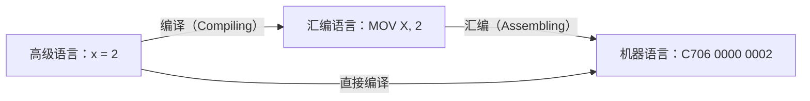
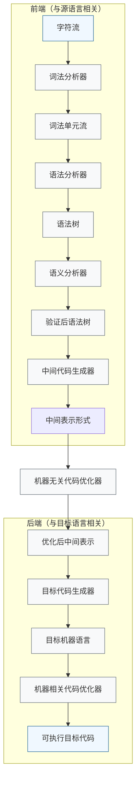
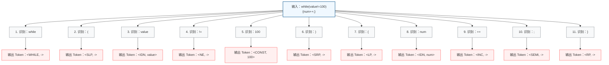

# 绪论

参考：

- [https://opensource.niutrans.com/complier-notes/pdf/compiler-notes.pdf](https://opensource.niutrans.com/complier-notes/pdf/compiler-notes.pdf)
- [https://github.com/zhuozhiyongde/Compiler-Principles-2024Fall-PKU](https://github.com/zhuozhiyongde/Compiler-Principles-2024Fall-PKU)

## 什么是编译？

编程语言按抽象层级由高到低分为三类：

- **高级语言（High Level Language）**
    - 示例：`x = 2`
    - 特点：接近人类自然语言，可读性高，与硬件无关
- **汇编语言（Assembly Language）**
    - 示例：`MOV X, 2`
    - 特点：与机器指令一一对应，以助记符形式表示
- **机器语言（Machine Language）**
    - 示例：`C706 0000 0002`
    - 特点：二进制编码，计算机可直接执行

## 编译系统的结构

编译器分为前端与后端两大部分：

| 部分         | 别称              | 核心特点                                                        |
| ------------ | ----------------- | --------------------------------------------------------------- |
| **分析部分** | 前端（Front End） | 与**源语言**相关，处理输入的源程序，生成中间表示                |
| **综合部分** | 后端（Back End）  | 与**目标语言/机器**相关，将中间表示转换为目标机器码             |

### 前端（分析部分）

- **词法分析器**
    - 输入：字符流
    - 输出：词法单元流（Token Stream）
    - 作用：将字符序列切分为有意义的词法单元（如关键字、标识符、常量等）
- **语法分析器**
    - 输入：词法单元流
    - 输出：语法树（Syntax Tree）
    - 作用：验证语法正确性，构建语法树表示程序结构
- **语义分析器**
    - 输入：语法树
    - 输出：经过语义检查的语法树
    - 作用：检查类型匹配、作用域等语义错误，进行静态语义验证
- **中间代码生成器**
    - 输入：语法树
    - 输出：中间表示形式（IR, Intermediate Representation）
    - 作用：生成与机器无关的中间代码，作为前后端的桥梁

### 后端（综合部分）

- **机器无关代码优化器**
    - 输入：中间表示形式
    - 输出：优化后的中间表示形式
    - 作用：不依赖目标机器，对中间代码进行优化（如常量传播、死代码删除）
- **目标代码生成器**
    - 输入：优化后的中间表示形式
    - 输出：目标机器语言
    - 作用：将中间代码映射为目标机器的汇编或机器指令
- **机器相关代码优化器**
    - 输入：目标机器语言
    - 输出：优化后的目标机器语言
    - 作用：利用目标机器的硬件特性（如寄存器分配、指令调度）进一步优化代码

## 词法分析

### 主要任务

1. 从左向右逐行扫描源程序字符，识别各个单词并确定其类型。
2. 将识别出的单词转换为统一的机内表示——词法单元（Token）。

Token 的定义：$\text{token}: \langle \text{种别码},\ \text{属性值} \rangle$

### 单词类型与种别码规则

| 序号 | 单词类型 | 包含示例                                                              | 种别码规则 |
| ---- | -------- | --------------------------------------------------------------------- | ---------- |
| 1    | 关键字   | `program`、`if`、`else`、`then`                                       | 一词一码   |
| 2    | 标识符   | 变量名、数组名、记录名、过程名                                        | 多词一码   |
| 3    | 常量     | 整型、浮点型、字符型、布尔型                                          | 一型一码   |
| 4    | 运算符   | 算术（`+ - * / ++ --`）、关系（`> < = >= <=`）、逻辑（`&& \|\| !`） | 一词一码   |
| 5    | 界限符   | `( ) { } ; , .`                                                       | 一词一码   |

## 语法分析

<!-- 这是一张图片，ocr 内容为： -->

<!-- 这是一张图片，ocr 内容为： -->

:::tips

- D：declaration（声明）
- T：Type（类型）
- IDS：identifier sequence（标识符序列）

:::

## 语义分析

### 主要任务

**收集标识符的属性信息：**

- 种属（kind）：简单变量、复合变量（数组、记录等）、过程等
- 类型（type）：整型、实型、字符型、布尔型、指针型等
- 存储位置与长度

<!-- 这是一张图片，ocr 内容为： -->

- 变量的值
- 变量和过程的作用域
- 参数与返回值信息：参数个数、参数类型、传递方式、返回值类型等

**语义检查：**

- 变量或过程<u>未经声明就使用</u>
- 变量或过程名<u>重复声明</u>
- <u>运算分量</u>类型不匹配（如将数据与过程相加）
- <u>操作符</u>与<u>操作数</u>之间类型不匹配，包括：
    - 数组下标不是整数
    - 对非数组变量使用数组访问操作符
    - 对非过程名使用过程调用操作符
    - 过程调用的参数类型或数目不匹配
    - 函数返回类型有误

### 符号表

语义分析的结果存放在符号表中：

<!-- 这是一张图片，ocr 内容为： -->

每个标识符对应符号表中的一行记录。符号表通常附带一个字符串表，NAME 字段由两部分组成，分别标识该标识符在字符串表中的起始位置和长度。

## 中间代码生成

常用的中间表示形式：

- **三地址码**：由类似汇编语言的指令序列组成，每条指令最多含三个操作数，指令序列唯一确定了运算的执行顺序。
- **语法结构树 / 语法树**

<!-- 这是一张图片，ocr 内容为： -->

